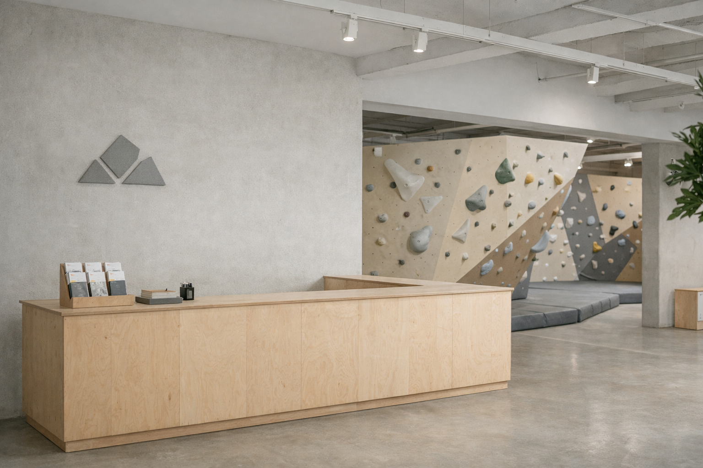

Running a bouldering gym isn't just about setting great routes; it's about getting people through the door. Effective promotions can bridge the gap between a quiet afternoon and a bustling community hub. However, the key is to drive traffic without conditioning your customers to only wait for discounts.

## The "Bring a Belay-tionship" (Even if it's Bouldering)

One of the most effective strategies is the "Bring a Friend for Free" Friday. While it sounds cliché, it lowers the barrier to entry for new climbers who might be intimidated to come alone.

**Why it works:**
- **Social Proof:** First-timers feel safer with an experienced friend.
- **Viral Growth:** Your existing members become your marketing team.
- **Upsell Potential:** A free climbing pass often leads to a shoe rental fee or a café purchase.

## The "Off-Peak" Pass

Most climbing gyms suffer from the 5 PM to 9 PM crush. To alleviate this and monetize your quiet hours, consider an "Early Bird" or "Lunch Crunch" membership.

*   **Offer:** 30% off standard membership, but check-ins are restricted to before 3 PM on weekdays.
*   **Target:** Students, freelancers, and shift workers.

## Competitions as Promotions

Hosting a "Citizen's Comp" is a fantastic way to generate hype. It’s not just for the pros. Create categories for beginners (V0-V2) to encourage participation from everyone.

> "A gym without events is just a place to workout. A gym with events is a community."

## Conclusion

Promotions shouldn't just be about discounting; they should be about *inviting*. By structuring your offers to solve specific problems (like quiet mornings or newbie anxiety), you build a sustainable business model.
